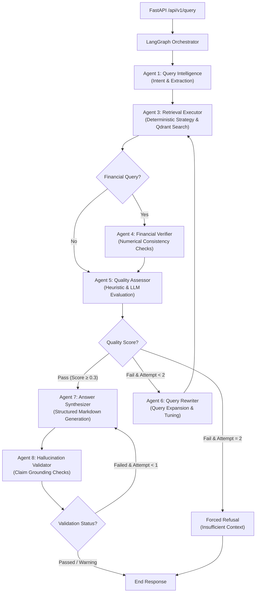

# M&A Due Diligence Intelligence Engine

[](https://www.python.org/)
[](https://qdrant.tech/)
[](https://github.com/langchain-ai/langgraph)
[]()
[](LICENSE)

A **hybrid agentic RAG engine** for mergers & acquisitions due diligence. It ingests multi-format data rooms (financial statements, legal contracts, board decks) and performs multi-step reasoning over them with **deterministic financial verification, hallucination guarding, and traceable citations** — prioritizing "I don't know" over confident hallucination on high-stakes financial/legal questions.

---

## Table of Contents
- [Architecture](#multi-agent-architecture)
- [Core Engineering Challenges Solved](#engineering-ma-due-diligence-challenges)
- [Key Features](#key-features--advanced-rag-strategies)
- [Tech Stack](#technology-stack)
- [Model Routing & Quota Engineering](#model-routing--quota-engineering)
- [Quick Start](#quick-start)
- [Results & Honest Limitations](#results--validation)
- [Roadmap](#roadmap)
- [Key Engineering Lessons](#key-engineering-lessons)
- [Project Structure](#project-structure)

---

## Multi-Agent Architecture

Orchestrated with a **LangGraph StateGraph** of **7 specialized graph nodes** (plus one deterministic, zero-LLM helper) collaborating through typed shared state, with checkpointing keyed by `(deal_id, session_id)`. Retrieval strategy selection is deterministic, not LLM-driven, to cut unnecessary latency and cost.



### The Agents

| # | Agent | Role |
|---|---|---|
| 1 | **Query Intelligence** | Classifies user intent, flags numerical-precision needs, extracts metadata filters |
| 2 | **Retrieval Strategy** *(deterministic, no LLM)* | Picks dense/sparse weights and top-k by query type — zero added latency |
| 3 | **Retrieval Executor** | Queries Qdrant using hybrid search and merges results via Reciprocal Rank Fusion (RRF).|
| 4 | **Financial Verifier** | Normalizes numbers (units/currency) and cross-checks figures against source tables |
| 5 | **Quality Assessor** | Scores context quality using a hybrid heuristic-LLM checker. |
| 6 | **Query Rewriter** | Reformulates the query when retrieval quality is insufficient (max 2 loops) |
| 7 | **Answer Synthesizer** | Generates structured, cited markdown answers |
| 8 | **Hallucination Validator** | Validates every claim against retrieved source text and flags unsupported ones |

---

## Engineering M&A Due Diligence Challenges

M&A due diligence involves reasoning over massive, multi-format data rooms (e.g., 1000+ page PDFs, financial spreadsheets, legal contracts), where **a wrong number is a hard failure, not graceful degradation**. The engine addresses this through the following mechanisms:

**1. Memory-Efficient PDF Streaming** — Loading 1000+ page PDFs into memory causes Out-Of-Memory (OOM) failures. The ingestion pipeline uses **PyMuPDF (fitz)** to stream layout blocks and text page-by-page. It keeps the memory footprint flat regardless of document length.

**2. Multi-Page Table Stitching** — Financial statements and cap tables routinely span page breaks. Naive chunking slices these tables mid-row, destroying structure. The **MultiPageTableStitcher** extracts tables page-by-page using `pdfplumber`, fingerprints their column structures (column counts and header similarities), and automatically stitches continuation tables across page boundaries into a single markdown table section with matching page-range metadata.

**3. Cell-Level Numeric Fidelity (4-Representation Tables)** — Financial queries require exact numbers. The engine processes tables into **4 concurrent representations** sharing a single `table_id`:
- **Narrative**: A text description of key items for semantic dense matching.
- **Row-by-Row**: Key-value pairs for precise cell lookup.
- **Metrics Summary**: Deterministic pandas-computed financial metrics (YoY growth, CAGR, margins) with explicit citation chains, preventing LLM arithmetic errors.
- **Markdown**: A clean markdown grid for answer generation.

If retrieval finds *any* of these representations, a table-id lookup automatically pulls all 4 sibling chunks from Qdrant. The synthesizer receives the exact markdown grid and verified computed metrics, preventing LLM hallucinations.

**4. Hierarchical Parent-Child Context Expansion** — Retrieving small, high-density chunks is optimal for search relevance, but lacks surrounding context. The engine retrieves 512-token semantic chunks but automatically swaps them for their larger **2048-token parent chunks** (from a dedicated parent collection) before synthesis. This provides the LLM with the full context (such as definitions or footnotes) without fragmenting the retrieval.

**5. Layout-Aware Heading Detection** — Instead of hardcoded formatting rules, headings are identified using per-page statistical font-size distribution (any text block with font size > page median * 1.2 is classified as a heading), maintaining hierarchical lineage across diverse document layouts.

---

## Key Features & Advanced RAG Strategies

- **Three-Tier Chunking** — Documents undergo structural parsing, followed by semantic chunking (sentence-boundary aware with 10% overlap) and custom tables/metrics preservation to avoid fragmentation.
- **Hybrid Dense + Sparse Search** — Merges vector search (**BAAI/bge-m3**, 1024-dim) with sparse lexical search (**FastEmbed BM25**) in a unified Qdrant database.
- **Reciprocal Rank Fusion (RRF)** — Custom rank-based fusion implementation that de-duplicates overlap and merges dense and sparse rankings, explicitly ignoring raw scores to prevent scale mismatch.
- **Cross-Encoder Reranking** — Utilizes `BAAI/bge-reranker-v2-m3` for cross-attention query-passage scoring, applying a sigmoid-activation map to normalize scores within `[0,1]`.
- **Document Versioning** — Automatically flags superseded document versions and traces information lineage.
- **PII & Risk Detection** — Flags PII at ingestion (excluded from retrieval by default) and surfaces risk signals (change-of-control, MAC clauses, litigation, etc.) on a dashboard
- **Token-Budget Governance** — Features a Postgres-backed (`BudgetTracker`) daily quota + RPM rate limiting per model, with a graceful in-memory fallback if Postgres is unavailable to keep API consumption under tight guardrails.

---

## Technology Stack

| Component | Technology | Detail |
|---|---|---|
| **Orchestration** | LangGraph | StateGraph + PostgresSaver (falls back to in-memory checkpointing) |
| **Vector Database** | Qdrant | Hybrid (dense + sparse) search, Self-Hosted, with local-disk fallback |
| **LLMs (Cloud)** | Gemini (via LiteLLM) | Capability-tiered ladders + multi-key rotation (see below) |
| **LLM (Local)** | Ollama / Qwen2.5-14B | Final fallback when all cloud quota is spent |
| **Embeddings** | BAAI/bge-m3 | 1024-dimensional dense vectors + FastEmbed BM25 sparse |
| **Reranker** | BAAI/bge-reranker-v2-m3 | Cross-encoder (Sigmoid Normalized) |
| **API Layer** | FastAPI | Structured JSON logging, async lifespan management |
| **Frontend** | Streamlit | 8 custom dashboard components (citations, risk, version history, agent trace) |
| **Database** | PostgreSQL | Budget tracking, LangGraph checkpoints |

---

## Model Routing & Quota Engineering

The Gemini free tier is lopsided in a way that dictates the entire routing design:

| Model | RPM | RPD | Role |
|---|---|---|---|
| `gemini-3.6-flash` | 5 | 20 | Synthesis (best reasoning) |
| `gemini-3.5-flash` | 5 | 20 | Synthesis |
| `gemini-3-flash` | 5 | 20 | Synthesis |
| `gemini-2.5-flash` | 5 | 20 | Synthesis |
| `gemini-3.5-flash-lite` | 15 | **500** | Agents — volume tier |
| `gemini-3.1-flash-lite` | 15 | **500** | Agents — volume tier |
| `gemini-2.5-flash-lite` | 10 | 20 | Agent overflow |

**Only the Lite tier can sustain traffic.** Every reasoning-grade model is capped at 20 requests/day. A query spends ~4 agent calls (classification, rewriting, quality assessment, validation) and 1 synthesis call — so putting agent traffic on a reasoning model would drain it in five queries, and it would then be unavailable to synthesis, which is the only place reasoning quality reaches the user.

Per API key that works out to **969 agent calls/day (~242 queries)** and **76 syntheses on reasoning-grade models** before any downgrade.

Hence two ladders, both defined in [`src/llm/model_registry.py`](src/llm/model_registry.py):

- **Agent ladder** — ordered by *daily capacity*, Lite models only. Reasoning models are deliberately excluded (enforced by a test).
- **Synthesis ladder** — ordered by *capability*, spilling to Lite only once the reasoning models are spent.

**Multi-key rotation.** Quotas are enforced per API key, so keys multiply capacity:

```bash
GEMINI_API_KEYS=key_one,key_two,key_three   # or GEMINI_API_KEY_1/2/…, or GEMINI_API_KEY
```

Selection drains one key on a given model before trying the next key on the **same** model, and only steps down a rung once every key is spent — so **answer quality degrades last, not first**. Across two keys that yields ~152 reasoning-grade syntheses before any downgrade, then ~950 Lite calls, then local Ollama.

This required a non-blocking `RateLimiter.try_acquire()`: the existing `acquire()` *sleeps* until the window opens, which is correct with one destination but would block on a saturated key while another sat idle — wasting exactly the capacity the extra keys were added for.

Two quota bugs were found and fixed by consolidating limits into one table: separate rate limiters summing to 20 RPM against a shared 15 RPM model quota, and per-bucket daily allowances summing to 960/day against a 500 RPD cap. Both were arithmetic errors over numbers that lived in three different files. The fix in each case is an invariant test, not a corrected constant.

---

## Quick Start

### 1. Prerequisites
Ensure you have Docker and Python 3.12+ installed.

### 2. Setup Env & Packages
```bash
# Clone the repository and configure environment variables
cp .env.example .env
# Edit .env — add GEMINI_API_KEYS (one or more, comma-separated) and the DB password

# Install requirements
pip install -r requirements.txt

# Install PyTorch for your GPU. --force-reinstall --no-deps is required:
# a plain `pip install torch --index-url ...` reports "Requirement already
# satisfied" against an existing CPU build and silently leaves it in place.
pip install --force-reinstall --no-deps torch --index-url https://download.pytorch.org/whl/cu128
```

**Check that the GPU is actually being used** — this is worth thirty seconds, because the failure is silent and costs about 5x on every query:

```bash
python -c "import torch; print(torch.__version__, torch.cuda.is_available())"
```

`2.11.0+cu128 True` is correct. Anything ending `+cpu`, or `False`, means the embedding and reranker models are running on CPU: everything still works and answers are identical, but retrieval goes from under a second to roughly 6–18 seconds per pass. Use `cu128` or later for RTX 50-series (Blackwell, sm_120); `cu118`/`cu124` for older cards. With no GPU, install plain `torch` and expect the slower path.

### 3. Local Ollama (fallback model)
Start the local Ollama server and pull the validation model:
```bash
# Start Ollama service (if not already running as a daemon)
ollama serve

# Fetch the local validation model
ollama pull qwen2.5:14b
```

### 4. Choose Deployment Path

#### Option A (fastest): One command

```bash
python run_demo.py
```

Starts Docker Desktop if it is not running, brings up Postgres and Qdrant, waits for each to be genuinely healthy, starts the API, ingests the sample data room if the index is empty, warms the local models, and opens the UI at `http://localhost:8501`. It checks each step rather than assuming it — every failure it reports has actually happened during development. `python run_demo.py --stop` shuts the containers down.

The models are loaded during startup rather than on first use, so the first question runs at the same speed as every one after it. That costs about 30 seconds of startup and removes roughly 9 seconds from whichever question gets asked first — which, in a live demo, is the one being watched.

#### Option B: Fully Containerized Stack (Recommended for Production/Evaluation)
Run the entire system (databases, API backend, and Streamlit frontend UI) inside Docker:
```bash
# Spin up all services
docker compose up -d

# Access the Streamlit dashboard: http://localhost:8501
# Access the FastAPI docs: http://localhost:8000/docs
```

#### Option C: Local Development Stack (Recommended for Development/Fast Reload)
Run only the databases in Docker and run the application services locally on your host:
```bash
# Spin up only PostgreSQL and Qdrant database services
docker compose up postgres qdrant -d

# Start the FastAPI backend server (in a new terminal window)
python run_api.py

# Start the Streamlit frontend dashboard (in a separate terminal window)
streamlit run app/streamlit_app.py
```

`run_api.py` rather than `uvicorn api.main:app` because **on Windows the latter loses durable checkpointing**. uvicorn hands asyncio an explicit `ProactorEventLoop` factory, psycopg refuses to run on that loop, and `AsyncPostgresSaver` fails at startup — the orchestrator then degrades to in-memory checkpoints, so a restart loses session state. Setting the event loop policy does not help, because a loop *factory* overrides the policy; `run_api.py` builds a `SelectorEventLoop` itself and hands uvicorn a server to run on it. On Linux the default loop is already selector-based, so the container path is unaffected and `uvicorn api.main:app` remains correct there.

### 5. Running Tests & E2E Validation
```bash
# Execute pytest suite (125 tests covering async safety, agents, quotas, RRF,
# sub-question decomposition, and SQL parameter binding)
pytest

# Execute the live E2E validation against the 41-question golden set
# (requires the API running and at least one Gemini key configured)
python tests/run_end_to_end_validation.py
```

---

## Results & Validation

Validated against a synthetic data room of **9 documents (~66K tokens)** — financial statements, merger agreement, board deck, quality of earnings report, customer contracts, employment and retention schedule, IP portfolio and litigation schedule, credit agreement, and a regulatory/privacy memo — using a hand-built golden Q&A set.

The set is **41 questions: 35 answerable** across financial, legal, comparative, summary and multi-hop, plus **6 unanswerable control questions** whose answers are absent from the corpus by construction. Ten of the answerable questions are multi-hop, requiring facts combined across two or more documents. The controls exist so the answer rate is falsifiable — without them, "never refuses" and "always finds the answer" look identical.

| Metric | Result |
|---|---|
| Completed without an unhandled exception | 41/41 |
| Answerable questions answered | 35/35 |
| Mean fact recall | 86% on a full-quota run; 71–87% across runs (see below) |
| Answers with every expected fact present | 24/35 |
| Citation-source match | 33/35 |
| Answers flagged as unsupported by the validator | 0/35 |
| Control questions where the engine did **not** fabricate | 6/6 |
| Mean latency per query | 30s in that run (CPU retrieval); 21–33s on GPU |

Recall is reported with its dependency stated, because that dependency turned out to be the largest single factor. Four runs of the identical 41 questions against an identical index scored 86.6%, 73.9%, 71.0% and 85.9%, and the ordering is explained not by code changes but by **which synthesis model served the run**: the 85.9% run had 38 of 41 answers written by `gemini-3.6-flash` on fresh daily quota, while the 71.0% run had drained to `gemini-3.5-flash` for most of its answers. Quoting the best figure alone would be the more flattering choice and the less honest one. Full per-query breakdown, including every answer verbatim, in [`RESULTS.md`](RESULTS.md).

Per-type recall on the full-quota run: legal 98.2%, multi-hop 85.2%, summary 83.3%, financial 83.8%, comparative 73.0%.

**These numbers predate one later fix and have not been re-measured against it.** Sub-question decomposition was additionally gated on `query_type`, so a question the model decomposed correctly but classified as `financial` had its sub-questions discarded (see below). Removing that veto can only add decomposition, never remove it, so the effect should be neutral-to-positive — but "should be" is not a measurement, and the table above is what was actually run.

**Three defects found by measurement rather than inspection.** Each was invisible to code review — the pipeline ran, returned plausible output, and logged no error:

1. **The quality gate was calibrated against a score distribution nobody had measured.** It averaged cross-encoder scores across the whole retrieved set and required `min(top_5) >= 0.2`. Cross-encoder outputs are bimodal (relevant 0.24–0.99, noise ~0.006), so retrieving more candidates made context look *worse*, and two questions with genuinely good context scored 0.638/0.645 and were refused anyway. Re-derived the dimensions and thresholds from a labelled sweep over the golden set.
2. **An LLM's guessed `document_category` was applied as a hard filter.** When the guess was wrong, the answer was outside the search space and the rewrite loop could not recover it. Now relaxed on retry.
3. **The hallucination validator saw less evidence than the writer.** It judged each chunk truncated to 500 characters while the synthesizer used the full chunk plus parent context, so it flagged correctly-sourced figures as unsupported — including several answers with 100% fact recall. Giving it the same context the writer had eliminated the false flags entirely.

**The refusal path is a deliberate safety feature, not something tuned away.** On all 6 control questions the engine declined to invent the missing figure — and notably by *partial* answer rather than blanket refusal: asked to compare churn against competitors, it reported the retention and competitor data that exist and explicitly stated that churn is not in the data room.

**Sub-question decomposition.** Multi-hop and comparative queries are split by Agent 1 into atomic sub-questions, each retrieved in its own pass and reranked against *itself*. This matters because the reranker scores every candidate against the whole question: a passage holding only a share price scores poorly against "what is the implied EV/EBITDA multiple", so it never survives to the context. Query expansion cannot fix that — rephrasing the question five ways still never asks for the price.

Two details make it work rather than merely exist:

- **Sub-questions do not inherit the parent's `document_category` filter.** They exist to look somewhere else; applying the parent's guess to them re-creates the problem. Measured: the EV/EBITDA query decomposed correctly into price, share count and EBITDA, but every pass inherited one filter and all three returned chunks from the same document.
- **It is additive, not a redistribution.** Splitting a fixed `final_top_k` across passes cost the parent query most of its slots, and a comparative question whose answer sat in one table the parent had already found went from 20% to 0% coverage. The parent keeps its full budget; sub-questions add a small allocation on top.
- **The classifier must not veto the decomposer.** Sub-questions were originally kept only when `query_type` was `multi_hop` or `comparative`. Asked for the implied EV/EBITDA multiple, Agent 1 decomposed the question correctly into price, share count and EBITDA — and classified it `financial`, so the veto discarded all three and the engine answered about the offer price instead. Emitting sub-questions *is* the model's judgment that the answer spans several facts; classification is a separate judgment made for routing. Requiring two independent guesses to agree made the feature fail silently whenever they disagreed. Now the prompt decides and `MAX_SUB_QUESTIONS` bounds the cost. Same question after the fix: 4 retrieval passes, 0 rewrite loops, confidence 1.00, and the multiple actually computed — **7.03x on Adjusted EBITDA of $99.0M versus 7.15x reported**.

Measured in isolation — retrieval only, no synthesis, so model choice cannot influence it — **fact coverage in the retrieved context rose from 64.2% to 84.7% (+20.4pp) across the 15 decomposable questions, with no regressions.** `comp_02` went 10% → 100%, `mh_06` 33% → 100%, `mh_07` 50% → 100%.

**Why the end-to-end number is measured separately from that.** Answer recall across runs is dominated by which synthesis model served the run, and that drifts within a day as the top rung's 20-request daily quota drains. Four runs of the same 41 questions scored 86.6%, 73.9%, 71.0% and 85.9% as the mix shifted between `gemini-3.6-flash` and `gemini-3.5-flash` — and question types that are **never** decomposed moved in lockstep (legal 100% → 73% → 98%, summary 72% → 50% → 83%). The fourth run tested the explanation rather than just restating it: run on fresh quota, 38 of its 41 answers were written by `gemini-3.6-flash`, and recall returned to the top of the range. Cross-run end-to-end comparison at this sample size therefore cannot attribute a change to a retrieval improvement, which is why the decomposition result above is measured on retrieval alone.

End-to-end, decomposition does show up where it should: `mh_05` — "what is the implied EV/EBITDA multiple on adjusted rather than reported EBITDA", the question that previously returned *"cannot be calculated"* — now answers at 100% fact recall, and multi-hop as a category reached 85.2%.

**Three times the measurement was wrong rather than the system.** Each was caught by inspecting answers the metric had marked as failures: a binary refused/answered flag scored a correct partial answer as a hallucination; the golden set docked recall for writing "thirty-six months" instead of "36 months"; and markdown bold markers broke substring matching, so `contains **no information** regarding` was scored as a fabrication. Fact matching and refusal detection now normalise emphasis and accept equivalent surface forms. Re-scoring the same answers with the corrected matcher changed recall by roughly two points and moved control precision from 5/6 to 6/6 — a reminder that on a small set the harness is as likely to be wrong as the pipeline.

**On latency.** A query is 21–33s end to end, and the split is worth knowing because only one half is under this project's control:

| | GPU (RTX 5070 Ti) | CPU-only PyTorch |
|---|---|---|
| Retrieval — embed, hybrid search, rerank | **0.8–3.8s** for up to 4 passes | 6–18s per pass |
| Everything else — 5–6 sequential LLM calls | ~20–28s | ~20–28s |

Retrieval is no longer the bottleneck; provider latency is. Synthesis runs on `gemini-3.6-flash`, capped at 5 RPM, so the rate limiter also paces harder than it would on a 15 RPM Lite model — a deliberate trade of wall-clock for better reasoning on the one call whose quality reaches the user. `VERIFICATION_BACKEND=local` moves the two verification agents to Qwen2.5-14B: quota-free, slower, needs a 12GB-VRAM host. Both paths are live and the cloud path falls back to local automatically when quota runs out.

**The GPU point is not a tuning note, it is a bug report.** This project ran its models on CPU for its entire life because `pip install torch --index-url .../cu128` reports *"Requirement already satisfied"* when any torch is installed — the CPU and CUDA wheels differ only by a local version tag, which pip does not treat as an upgrade. The code selected the device correctly (`"cuda" if torch.cuda.is_available() else "cpu"`), the logs said `CPU`, and nobody read them. A 12GB GPU sat idle next to a 40-passage cross-encoder rerank. The fix was one `--force-reinstall --no-deps`; the lesson is that a silent 5x is harder to notice than a crash.

**Scope, stated plainly:** this is a synthetic data room of 9 documents (~66K tokens), not a real one. It is large enough that retrieval must discriminate across documents — the multi-hop questions each require combining two or more — but a production data room is orders of magnitude larger, and these numbers should not be read as evidence of behaviour at that scale.

---

## Roadmap

- [ ] Decompose comparative queries into sub-queries (one bidder/methodology per Qdrant lookup) instead of relying solely on query expansion
- [ ] Cache embeddings for repeated query expansions to cut redundant model calls
- [ ] Enforce TPM (tokens/minute) alongside RPM/RPD — needs per-call token accounting the pipeline does not yet do
- [ ] Passage-level citations by parsing the synthesizer's inline `[file | p.N | Section]` markers (see Decision 16)
- [ ] Replace the in-memory deal store with a Postgres-backed table for multi-instance deployments
- [ ] Expand the synthetic corpus to better stress-test comparative and multi-hop retrieval

---

## Key Engineering Lessons

**VRAM budgeting (12GB constraint):** running an embedding model, a cross-encoder reranker, and a 14B local LLM concurrently risks CUDA OOM. Solved with separate `ThreadPoolExecutor` pools for embedding vs. reranking so one doesn't starve the other.

**Local LLM JSON truncation:** Ollama's default 2048-token context window was silently truncating JSON outputs during long evaluations. Fixed by forcing `num_ctx=8192` for all Ollama calls.

**Metadata loss during chunking:** the Financial Verifier was silently skipping execution because chunking dropped structural markers (`is_table`, `content_type`). Fixed by propagating chunk metadata explicitly through to Qdrant payloads.

**TOCTOU race in budget tracking:** an earlier `check → increment` pattern allowed two concurrent requests to both pass the budget check and overshoot the daily limit. Replaced with a single atomic conditional `UPDATE` statement.

**Quality thresholds must be calibrated against the score distribution they gate.** The quality gate averaged reranker scores across the whole retrieved set and required `min(top_5) >= 0.2`. But a cross-encoder is a per-pair relevance classifier, and its outputs are sharply bimodal — on this corpus, relevant chunks score 0.24–0.99 while noise sits near 0.006. Two consequences followed: averaging over the top-k meant **retrieving more candidates made the context look worse**, penalising recall; and requiring the fifth-best chunk to be excellent was a bar peaked distributions rarely clear. Two golden questions scored 0.638 and 0.645 — genuinely good context — and were refused anyway. Fixed by scoring the *usable* evidence (max score for relevance, mean of chunks above a measured floor for precision, count relative to per-type expectation for completeness), with the floor and thresholds derived from a labelled sweep rather than chosen by hand.

**An LLM's guess must not become a hard filter.** Agent 1 inferred a `document_category` and it was applied as a hard Qdrant `must` condition. When the guess was wrong the answer was removed from the search space entirely, and the rewrite loop could never recover it because rewriting changes query text, not filters. Measured: a question about per-share merger consideration was classified `financial`, which filtered out the merger agreement — the one document containing the answer. It also compounded two error sources, since the category itself was assigned by a heuristic classifier at ingestion. Fixed with progressive filter relaxation: the category filter is kept on the first attempt for precision and dropped on retry, when the system is explicitly trading precision for recall. Deal isolation and PII/version filters are never relaxed — those are correctness constraints, not relevance hints.

**A binary refusal metric mis-scores the behaviour you actually want.** Adding unanswerable control questions to the golden set initially showed 1/3 "refusal precision" — apparently hallucinating. The answers told a different story: the engine had said *"The provided documents do not contain the revenue figures for Q1 FY2024"* with a citation, and for a churn question had reported the retention and competitor data that were present while explicitly flagging churn as absent. That partial answer is better due-diligence behaviour than a blanket refusal, but a refused/answered flag scores it as a failure. The metric was measuring the wrong thing; what matters is whether the engine **fabricated the missing figure**. Re-scored on that basis: 3/3.

**"Nothing matched" is a valid outcome, not an exception.** RRF raised `ValueError` when both retrievers returned empty, turning a legitimate no-results query into a 500. It now returns an empty list so the Quality Assessor sees zero chunks and takes the refusal path the pipeline is built around.

**Three bugs that only existed on a clean environment.** Rebuilding the stack from scratch — new containers, empty volumes — surfaced failures that a long-lived development machine had been hiding, and all three shared a shape: total, silent, and invisible to the tests.

- **A dependency range that allowed an incompatible pair.** `requirements.txt` permitted `qdrant-client>=1.9.0,<2.0.0` while `docker-compose.yml` pinned the server to `v1.12.1`; pip resolved 1.18.0. Qdrant's contract is at most one minor version of skew. Over gRPC the newer client's vector encoding was unreadable by the old server, so *every* ingest failed — while REST, health checks, collection creation and search all worked. The harness dutifully ran 41 questions against an empty index and reported 0% recall, which looks exactly like a catastrophic regression in the engine. The client detects this and raises a `UserWarning`; a JSON log handler swallows it. Now: versions pinned to each other, `assert_server_compatible()` **raises** at startup before anything writes, and the harness aborts if fewer documents ingest than the corpus contains.
- **Schema drift hid a broken SQL binding.** The budget tracker passed `date.today().isoformat()` into `reset_date = $1::date`. asyncpg encodes by inferred type and rejects a string, and the server-side cast happens too late to help. It had never failed because the long-lived database still stored that column as text from an older schema revision — and every tracker test sets `_is_mock = True`, skipping SQL entirely. Green suite, and not a single query could complete against a correctly-created database. It broke every *first* deploy, which is the one nobody has logs for.
- **Durable checkpointing had never worked on Windows.** Covered above; the point here is that the only evidence was one `WARNING` line, and the system kept running perfectly well without the durability it claimed to have.

The common lesson is that a green test suite plus a healthy `/health` endpoint plus plausible output is not evidence that the system works. All three failures were downstream of state that the development machine happened to have and a fresh one does not.

More decisions and trade-offs are logged in [`DECISIONS_LOG.md`](DECISIONS_LOG.md).

---

## Project Structure

```
api/                  FastAPI routes, request/response models
app/                  Streamlit UI (8 components) + dashboard
src/
  agents/             8 LangGraph agent nodes + retrieval strategy
  data_processing/     PDF/DOCX/PPTX/Excel processors, chunkers, PII/risk detectors
  llm/                 LiteLLM wrapper, budget tracker, rate limiter, prompt templates
  vector_db/           Qdrant client, hybrid search, RRF fusion, reranker
  workflow/            LangGraph state machine, orchestrator, conditional edges
  utils/               Logging, token counting, audit log, metrics
tests/                 125 tests + golden Q&A set + live E2E runner
config/                Qdrant, LiteLLM, and chunking YAML configs
```

---

## License

Licensed under the [MIT License](LICENSE).

---

## Author

**Makilesh M** — [LinkedIn](https://www.linkedin.com/in/makilesh/) · [GitHub](https://github.com/makilesh) · [Portfolio](https://makilesh.github.io/)
