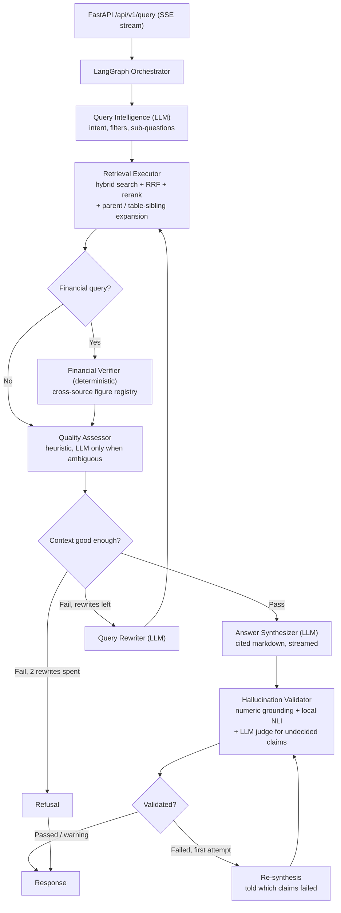

# Redline

**Evidence-grounded M&A due diligence.** Ask a question of a deal's data room; get an answer where every claim is traced to its source and every figure is checked against it — or a clear statement of what the documents don't say.

[](https://github.com/Makilesh/redline-diligence/actions/workflows/ci.yml)
[](https://www.python.org/)
[](https://qdrant.tech/)
[](https://github.com/langchain-ai/langgraph)
[](LICENSE)

Redline is a **hybrid agentic RAG engine for M&A (mergers & acquisitions) due diligence**. It ingests a multi-format data room — financial statements, merger agreements, board decks, credit agreements — and answers questions that require combining facts across several documents. The name is the term of art for a marked-up contract draft; the engine tracks redlines as first-class metadata.

The design constraint that shapes everything: **in due diligence a wrong number is a hard failure, not graceful degradation.** A reviewer told "I can't find this" loses a minute. A reviewer given a confident, wrong EBITDA figure can misprice a deal. So the engine is built to refuse, every figure in an answer is checked against the source text, and refusal is measured as carefully as accuracy.

---

## What it looks like

> **Q: What is the Section 280G excise tax exposure and which executives trigger it?**
>
> **Total potential Section 280G excise tax exposure: $2.4 million**
> **Executives triggering excess parachute payments:** Marsh (CEO), Wu, and Chen.
>
> Marsh, Wu and Chen are expected to exceed the Section 280G safe harbour threshold, exposing the Company to a 20% excise tax and the loss of the corresponding corporate tax deduction `[employment_and_retention_agreements.txt | Section 280G]`. The Company has **not** obtained a shareholder cleansing vote…

No single passage states all of this. The exposure figure, the affected executives and the cleansing-vote status sit in different sections, and the question has to be decomposed before any of them can be retrieved. Each figure in the answer ($2.4 million, 20%) is then located in the retrieved text before the answer is shown.

---

## Table of Contents
- [Architecture](#architecture)
- [Ingestion](#ingestion)
- [Retrieval](#retrieval)
- [Answer verification](#answer-verification)
- [Model routing & quota engineering](#model-routing--quota-engineering)
- [Evaluation](#evaluation)
- [Public demo guardrails](#public-demo-guardrails)
- [Technology Stack](#technology-stack)
- [Quick Start](#quick-start)
- [Engineering notes](#engineering-notes)
- [Limitations](#limitations)
- [Roadmap](#roadmap)
- [Project Structure](#project-structure)

---

## Architecture

A **LangGraph StateGraph** sharing typed state across nine nodes, checkpointed to Postgres by `(deal_id, session_id)`. Only the nodes that genuinely need language understanding call an LLM; retrieval strategy, financial verification and most of answer verification are deterministic or run on small local models, because on a free API tier every avoided call is capacity for the one that matters — synthesis.



| # | Node | Role | LLM? |
|---|---|---|---|
| 1 | **Query Intelligence** | Classifies intent, extracts metadata filters, decomposes multi-fact questions into sub-questions | Lite model |
| 2 | **Retrieval Strategy** | Picks dense/sparse weights and top-k by query type | No — a lookup |
| 3 | **Retrieval Executor** | Hybrid search over Qdrant, Reciprocal Rank Fusion, cross-encoder rerank, parent-section and table-sibling expansion | No |
| 4 | **Financial Verifier** | Builds a registry of every figure in the financial context and flags the same metric reported differently across sources | No |
| 5 | **Quality Assessor** | Scores whether the retrieved context can support an answer at all | Only in the ambiguous band |
| 6 | **Query Rewriter** | Reformulates and relaxes filters when retrieval comes back thin (max 2 loops; its config changes are whitelisted and clamped) | Lite model |
| 7 | **Answer Synthesizer** | Writes the cited answer to the user's original question, or declines; streams tokens | Reasoning model |
| 8 | **Hallucination Validator** | Grounds every figure deterministically, checks every claim with a local NLI model, and asks an LLM judge only about claims neither could decide | Only for undecided claims |

A typical query makes **2–3 LLM calls** (previously 3–4, one of which re-derived arithmetic the code can do exactly).

---

## Ingestion

Every advertised format has a fixture test that builds a real file and runs it through the production path (`tests/test_ingestion_formats.py`).

- **PDF** — PyMuPDF text with per-page layout statistics: a block is a heading when its font size exceeds the page median × 1.2. Passages are cut at page boundaries so each citation carries its real page.
- **Multi-page table stitching** — `pdfplumber` tables are fingerprinted by column structure and header similarity; a headerless table on the *next* page is stitched onto its predecessor into one table with a page range.
- **DOCX** — clean text is the document with tracked insertions accepted and deletions dropped; tables are read in document order; genuinely changed paragraphs are indexed separately as redlines.
- **XLSX / PPTX** — sheets and slide tables go through the same table converter as PDF tables; PPTX keeps slide numbers and speaker notes.
- **Plain text** — a heading-aware parser (ALL-CAPS lines, `Section 1.2 —`, `#`) so citations name a real section. No page number is invented for formats that don't have pages.

**Tables are stored four ways under one `table_id`**: a narrative for dense matching, row-by-row key–value pairs for exact lookup, a deterministically computed metrics summary (YoY growth, CAGR, margins — pandas, not the LLM), and a markdown grid. Retrieving any one pulls its siblings, so the synthesizer always sees the exact grid.

**Parent–child chunks**: ~512-token child chunks are what gets searched (hard cap 800); ~2048-token parent sections are what the synthesizer and validator read.

**Ingest is idempotent.** `doc_id` is derived from the deal and the file's SHA-256, point IDs from the chunk ID, so re-uploading identical bytes replaces rather than duplicates. A failed upsert rolls back every point already written for that document. Uploads are size-capped, filenames sanitised, Office archives checked for zip bombs, and parsing runs off the event loop.

PII (SSNs, account numbers, compensation data) and risk signals (change of control, MAC clauses, litigation…) are detected at ingestion. PII-flagged chunks are excluded from retrieval by default; the detectors are regex-based and tuned for recall — see [Limitations](#limitations).

---

## Retrieval

- **Hybrid dense + sparse** — `BAAI/bge-m3` (1024-dim) and FastEmbed BM25 in one Qdrant deployment, fused with a rank-based **Reciprocal Rank Fusion** that ignores raw scores to avoid scale mismatch.
- **Cross-encoder rerank** — `BAAI/bge-reranker-v2-m3` locally (`ms-marco-MiniLM-L-6-v2` on the CPU-only Space), sigmoid-normalised to [0, 1].
- **Sub-question decomposition** — query expansion rephrases the same question and cannot retrieve a fact the question never asks for. A multi-fact question is split into atomic sub-questions, each retrieved in **its own pass and reranked against itself**, then merged so every facet keeps a share of the context. A passage containing only a share price scores near zero against "what is the implied EV/EBITDA multiple?" and high against "what is the per-share merger consideration?".
- **Server-enforced filters** — deal isolation, the current-version filter and PII exclusion are applied by the server on every query. The LLM can suggest a document category; it cannot see superseded versions or PII, because those conditions are never read from model output.

---

## Answer verification

A validator that is itself an LLM grading another LLM tells you what one model thinks of another. This one checks, cheapest first:

1. **Numeric grounding (deterministic).** Every figure in the answer — `$452.8M`, `USD 1.2bn`, `17.0%`, `8.5x` — is extracted, unit-normalised (including units a table states only in its header), and located in the retrieved text within rounding tolerance. Years, dates, section numbers (`280G`, `4.3(a)`) and page references are skipped. A figure computed from two grounded figures in the same sentence or table row counts as *derived*; anything else is *unsupported*.
2. **Claim-level entailment (local NLI).** Each claim is scored against sentence-sized windows of the chunks it cites, plus the best lexical matches elsewhere — a correct claim with a sloppy citation isn't failed for the citation alone. `cross-encoder/nli-deberta-v3-small` on GPU, `-xsmall` on CPU.
3. **LLM judge, only when needed.** Claims neither step could decide go to a lite model in **one batched call**; the common case makes none. An NLI contradiction alone never fails an answer: in calibration, all five of the small model's ≥0.9-confidence contradictions were wrong, so a contradiction must be confirmed by the judge.

An answer **fails** on any confirmed contradiction or any figure not found in the context, and gets **one** re-synthesis that is told exactly which claims failed. It is a **warning** when non-numeric claims can't be confirmed. **Confidence is computed, not self-reported**: the share of supported claims, averaged with the share of grounded figures when there are any. Per-claim results are returned as `claim_checks`.

Document text is wrapped in escaped `<document>` tags and both prompts treat it as untrusted data — in M&A the data room comes from the counterparty, so prompt injection is adversarial input by design, not a hypothetical.

---

## Model routing & quota engineering

The Gemini free tier is lopsided in a way that dictates the whole design: every reasoning-grade model is capped at **20 requests/day**, while the Lite tier allows **500**.

| Model | RPM | RPD | Role |
|---|---|---|---|
| `gemini-3.7-flash` | 5 | 20 | Synthesis (newest reasoning) |
| `gemini-3.6-flash` | 5 | 20 | Synthesis |
| `gemini-3.5-flash` | 5 | 20 | Synthesis |
| `gemini-3-flash-preview` | 5 | 20 | Synthesis |
| `gemini-2.5-flash` | 5 | 20 | Synthesis — grandfathered keys only |
| `gemini-3.5-flash-lite` | 15 | **500** | Agents — volume tier |
| `gemini-3.1-flash-lite` | 15 | **500** | Agents — volume tier |
| `gemini-2.5-flash-lite` | 10 | 20 | Agents — grandfathered keys only |

Putting agent traffic on a reasoning model would drain it in five queries and leave nothing for synthesis — the one call whose quality reaches the user. Hence **two ladders**: the agent ladder ordered by *daily capacity* with reasoning models excluded (enforced by a test), and the synthesis ladder ordered by *capability*, spilling to Lite only once the good models are spent, and finally to local Ollama.

**Keys multiply capacity, so rotation drains one key on a model before stepping down a rung** — answer quality degrades last, not first. That required a non-blocking `try_acquire()`: the natural `acquire()` sleeps until the rate window opens, which would block on a saturated key while another sat idle.

**Failures are classified by what they actually mean**, because each implies a different repair:

| Signal | Meaning | Response |
|---|---|---|
| 429 | this key is spent on this model | rotate to another key |
| 503 / timeout | the model is unresponsive for everyone | skip the model, escalating per-model backoff |
| 404 "no longer available" | this key may never use this model | retire that one slot, permanently |
| auth error | the credential is bad | retire the key across all models |

That taxonomy is not academic. `gemini-2.5-flash` answers on two of five configured keys and 404s on the rest — Google grandfathers older keys when a model closes to new sign-ups, so **availability is a property of the (key, model) pair, not of the model.** Retiring the model would have discarded real capacity; retiring the key would have discarded more.

Quotas live in one table — [`src/llm/model_registry.py`](src/llm/model_registry.py) — with invariant tests, because two earlier quota bugs were arithmetic errors over constants duplicated across three files. The full failure taxonomy currently applies to synthesis and verification calls; see [Limitations](#limitations).

---

## Evaluation

Validated against a synthetic data room of **9 documents (~66K tokens)** — committed in [`data/sample_deal/`](data/sample_deal) — with a hand-built golden set of **41 questions: 35 answerable** (10 of them multi-hop) plus **6 unanswerable controls** whose answers are absent by construction. The controls are what make the answer rate falsifiable — without them, "always finds the answer" and "never refuses" produce identical numbers.

### Retrieval (committed harness, deterministic, zero LLM calls)

[`eval/`](eval) indexes the corpus into an in-memory Qdrant with the real models and runs the production retrieval node. Relevance is derived from the golden facts, so no chunk IDs need hand-labelling; sub-questions were generated once by the real Query Intelligence node and cached, so reruns make no API calls and two runs produce identical numbers. CPU and GPU runs match to 1e-4 on reranker scores.

| ablation | fact coverage@10 | fact coverage (final context) | recall@10 | MRR@10 | nDCG@10 |
|---|---|---|---|---|---|
| dense only | 85.6 | — | 68.5 | 58.2 | 56.6 |
| sparse only (BM25) | 73.1 | — | 46.6 | 52.0 | 45.5 |
| hybrid RRF, no rerank | 85.3 | — | 61.5 | 60.4 | 54.5 |
| **production** (hybrid + rerank + expansion) | 90.7 | 91.6 | 76.4 | **78.7** | 71.3 |
| **production + decomposition** | **91.6** | **92.6** | **77.2** | 77.2 | **72.3** |

*Fact coverage* is the share of a question's expected facts present in the retrieved text; the ceiling on this corpus is 99.0% (one expected figure is a computed multiple that appears in no document). Decomposition helps where evidence is genuinely spread across documents — multi-hop fact coverage 83.3 → 86.7 @10 (86.7 → 90.0 in the final context) — improves one question and regresses none. An earlier, uncommitted measurement credited decomposition with +10pp; that was taken on the old ingestion pipeline, and most of that headroom has since been closed by ingestion itself (real sections, parent context, table siblings). The committed number is the one to trust.

The rerank stage is what moves MRR from ~60 to ~79: the right chunk is usually in the hybrid candidates; the cross-encoder puts it first.

Run it: `python -m eval.run_retrieval_eval --baseline eval/baseline.json` — exits non-zero on a regression beyond tolerance. It runs in CI on demand and weekly. Details and caveats in [`eval/README.md`](eval/README.md).

### End-to-end (live, quota-dependent)

`tests/run_end_to_end_validation.py` drives the whole pipeline through the API. The last full run (2026-08-25, **before** the September ingestion and verification rework — rerun pending):

| Metric | Result |
|---|---|
| Completed without an unhandled exception | 41/41 |
| Answerable questions answered | 35/35 |
| Mean fact recall | **86.3%** |
| Answers containing every expected fact | 26/35 |
| Citation-source match | 33/35 |
| Controls where the engine did **not** fabricate | 6/6 |
| Latency per query | 13–36s |

**One caveat matters enough to state up front.** End-to-end recall on this set moves with *which synthesis model served the run*, and that depends on daily quota and provider health rather than on anything in this repository. Runs of identical questions against an identical index have scored 86.6%, 73.9%, 71.0%, 85.9%, 62.1%, 86.3% and 80.1% — the 62.1% run coincided with a Gemini incident that truncated a third of its answers, and the last two are both clean runs with zero answers lost upstream ([Decision 48](DECISIONS_LOG.md)). [`RESULTS.md`](RESULTS.md) therefore records the synthesis model mix and upstream-failure count with every report, and retrieval changes are measured with the deterministic harness above instead.

The refusal path is a feature, not a fallback: on all 6 controls the engine declined to invent the missing figure — usually by answering the part it *could* support and naming the gap explicitly. The retrieval harness shows where that behaviour comes from: the context-quality gate refuses 2 of the 6 controls outright, sends 1 to the LLM, and admits 3 whose documents are on-topic but lack the asked-for figure — for those, it is synthesis and verification that decline.

---

## Public demo guardrails

The hosted demo runs on free tiers and is open to anyone, so the API assumes it will be scripted against ([`api/security.py`](api/security.py)):

- **Per-IP rate limits** on queries (5/min, 50/day) and uploads, a **concurrency cap** that answers 503 immediately instead of queueing, and a **global daily query cap** as the last guard on the shared Gemini quota.
- **Visitor sandboxes.** Uploads go to a per-visitor sandbox deal with a TTL; sandboxes are hidden from other visitors, and their creation time is encoded in the ID so the sweeper reclaims orphans even after a restart. The demo deal cannot be written to or deleted without the admin key.
- **Compliance override is server-side.** `include_pii` is forced off for public callers.
- **No internal errors leak.** Clients get a generic message and a request ID; the detail goes to the log.

---

## Technology Stack

| Component | Technology | Detail |
|---|---|---|
| **Orchestration** | LangGraph | StateGraph + Postgres checkpointer (falls back to in-memory) |
| **Vector Database** | Qdrant | Hybrid (dense + sparse) search; self-hosted, Qdrant Cloud, or in-memory for eval |
| **LLMs (Cloud)** | Gemini via LiteLLM | Capability-tiered ladders + multi-key rotation |
| **LLM (Local)** | Ollama / Qwen2.5-14B | Final fallback when all cloud quota is spent (local runs only) |
| **Embeddings** | BAAI/bge-m3 | 1024-dim dense + FastEmbed BM25 sparse |
| **Reranker** | BAAI/bge-reranker-v2-m3 | Cross-encoder, sigmoid-normalised |
| **Verification** | nli-deberta-v3 (small/xsmall) | Local claim-level entailment |
| **API** | FastAPI | SSE streaming, structured JSON logging, rate limiting |
| **Frontend** | Next.js (hosted) · Streamlit (local console) | Streamed pipeline timeline, citations, sandbox uploads |
| **Database** | PostgreSQL | Quota tracking, LangGraph checkpoints |
| **Observability** | Langfuse (optional) | LLM call tracing via LiteLLM callbacks when keys are set |

Deployed as a Next.js frontend on Vercel and a single Linux VM running the API, Qdrant and Postgres behind Caddy (automatic HTTPS) via `docker-compose.prod.yml`. See [`DEPLOYMENT.md`](DEPLOYMENT.md).

---

## Quick Start

### 1. Prerequisites
Docker and Python 3.11+.

### 2. Setup

```bash
git clone https://github.com/Makilesh/redline-diligence.git && cd redline-diligence
cp .env.example .env
# Edit .env — add GEMINI_API_KEYS (one or more, comma-separated) and the DB password

pip install -r requirements-dev.txt   # runtime + test tooling

# PyTorch for your GPU. --force-reinstall --no-deps is required: a plain
# `pip install torch --index-url ...` reports "Requirement already satisfied"
# against an existing CPU build and silently leaves it in place.
pip install --force-reinstall --no-deps torch --index-url https://download.pytorch.org/whl/cu128
```

Verify the GPU is actually in use — this failure is silent and costs about 5x on every query:

```bash
python -c "import torch; print(torch.__version__, torch.cuda.is_available())"
```

Anything ending `+cpu`, or `False`, means the embedding, reranker and NLI models run on CPU: answers are identical, but retrieval goes from under a second to 6–18s per pass. Use `cu128`+ for RTX 50-series (Blackwell), `cu118`/`cu124` for older cards.

### 3. Run it

```bash
python run_demo.py            # --reindex to rebuild the index from scratch
```

Starts Docker Desktop if needed, brings up Postgres and Qdrant, waits for each to be genuinely healthy, starts the API, ingests the sample data room if the index is empty, warms the local models, and opens the UI at `http://localhost:8501`. `--stop` shuts the containers down. After upgrading from an index built before September 2026, run once with `--reindex`.

<details>
<summary>Other ways to run</summary>

**Fully containerized:** `docker compose up -d` — API on `:8000`, UI on `:8501`.

**Development:** `docker compose up postgres qdrant -d`, then `python run_api.py` and `streamlit run app/streamlit_app.py`. The Next.js frontend: `cd web && npm ci && npm run dev`.

`run_api.py` rather than `uvicorn api.main:app`, because on Windows the latter loses durable checkpointing: uvicorn hands asyncio an explicit `ProactorEventLoop` factory, psycopg refuses to run on it, and the orchestrator silently degrades to in-memory checkpoints. On Linux either command is fine.

**Local fallback model** (optional): `ollama serve && ollama pull qwen2.5:14b`.
</details>

### 4. Tests and evaluation

```bash
pytest                                                    # offline suite — what CI runs
python -m eval.run_retrieval_eval --baseline eval/baseline.json   # retrieval regression gate
python tests/run_end_to_end_validation.py                 # live 41-question golden set (spends quota)
```

CI runs ruff and the offline suite on every push, plus `tsc`, eslint and a production build of the web app.

---

## Engineering notes

A few decisions driven by measurement rather than intuition. The full record — including the ones that turned out to be wrong — is in [`DECISIONS_LOG.md`](DECISIONS_LOG.md).

**A knob that is computed but never applied is a claim, not a feature.** Every retrieval config carried a `reranker_threshold`, the rewriter prompt told the model to lower it, and nothing read it. Wiring it in was the obvious fix; measuring it first showed it cut final-context fact coverage from 91.6% to 85.2% — one summary question fell from 100% to 0% — because a cross-encoder threshold tuned in the abstract discards chunks that carry exactly one needed fact. It was deleted instead. Irrelevant context is the Quality Assessor's call, and that gate is calibrated.

**Quality thresholds have to be calibrated against the distribution they gate.** The context-quality gate averaged reranker scores and required `min(top_5) >= 0.2`. But a cross-encoder is a per-pair classifier and its output is sharply bimodal — relevant chunks score 0.24–0.99 on this corpus, noise sits near 0.006. Averaging meant **retrieving more candidates made context look worse**; two questions with genuinely good context scored 0.638 and 0.645 and were refused. Rebuilt to score the *usable* evidence, with the relevance floor derived from a labelled sweep.

**An LLM's guess must not become a hard filter — and an LLM must not be able to widen its own access.** Agent 1's inferred `document_category` was applied as a hard Qdrant condition, so a wrong guess removed the answer from the search space; it now comes off whenever the query has been decomposed. Worse, its output schema included `is_current_version`, and the filter builder skipped its default current-version condition whenever that key was present — so superseded documents were silently searchable on every query. Version, PII and deal filters are now enforced server-side and never read from model output.

**A binary refusal metric measures the wrong thing.** Control questions initially scored 1/3 on "refusal precision", apparently hallucinating. Reading the answers showed the opposite — the engine had reported the data that *did* exist and named the missing figure. What matters is whether it **fabricated**; re-scored on that basis, 6/6.

**Three bugs existed only on a clean environment.** A `qdrant-client` version range that resolved six minor versions ahead of the pinned server, so every gRPC write failed while REST, health checks and search kept working — the harness ran 41 questions against an empty index and reported 0% recall. An ISO date string bound to a `DATE` column. And durable checkpointing that had never worked on Windows at all. Each was total, silent, and invisible to a green test suite.

**A model can be unhealthy without being broken.** When `gemini-3.7-flash` began timing out, the timeout matched none of the failure classifiers and fell through to the generic retry path — three attempts at 120s, exhausting the client's budget before a healthy model was ever tried. Timeouts are now treated as unavailability, with an escalating per-model backoff.

**Guards can be worse than the bug they fix.** A check that rejected uncited answers also rejected *correct refusals*, which have nothing to cite. Three good models declined accurately, all three were scored as failures, and the ladder burned three scarce reasoning slots to land on the weakest model. It now distinguishes an answer that declines from one that asserts.

---

## Limitations

- **The corpus is synthetic and small.** 9 documents is enough that retrieval must discriminate between them, but a real data room is orders of magnitude larger; at ~110 chunks the collection never exercises Qdrant's HNSW index or quantization.
- **The end-to-end numbers predate the September rework** and move with quota state; the retrieval harness is the reliable signal.
- **Verification is conservative.** The small NLI model cannot confirm many paraphrased, non-numeric claims, so most answers land at *warning* rather than *passed*. Warnings never trigger a retry; only a confirmed contradiction or an ungrounded figure does.
- **Arithmetic across documents is model-dependent.** Retrieval supplies the inputs for an implied multiple; whether the model combines them correctly varies by rung. The validator marks such figures as derived or unverified rather than pretending to check them.
- **PII and risk detection are regex-based** and tuned for recall, so they produce false positives (and PII-flagged chunks are excluded from retrieval).
- **Agents 1, 5 and 6 don't descend the model ladder** on a 429 — they retry the same key, then fail the query. Synthesis and verification do descend. Quota is debited at selection, so a 503 still spends a daily unit.
- **Structured LLM output is JSON-mode, not schema-validated.**
- **Rate limits and cooldowns are in-process.** The daily quota counters are shared through Postgres; per-minute limits assume a single API worker.
- **TPM is declared but not enforced.** RPM and RPD are.

---

## Roadmap

- [ ] One LLM router for every agent: typed LiteLLM exceptions, ladder descent everywhere, quota refunded on 503/timeout
- [ ] Pydantic-schema structured output for the JSON agents
- [ ] Recalibrate the Quality Assessor floors per reranker model (the Space runs MiniLM)
- [ ] Qdrant Query API (server-side prefetch + fusion) and BM25 with the IDF modifier
- [ ] Rerun the end-to-end golden set on the reworked pipeline
- [ ] A larger corpus with real PDF and XLSX documents, to stress table handling and multi-hop retrieval

---

## Project Structure

```
run_demo.py           One-command local launcher (Docker, API, ingest, UI)
run_api.py            API entrypoint — selector event loop for Postgres checkpointing
api/                  FastAPI routes, request/response models, public-demo guardrails
app/                  Streamlit local console
web/                  Next.js frontend (hosted on Vercel)
src/
  agents/             LangGraph nodes + deterministic retrieval strategy
  data_processing/    Format processors, chunkers, table converter, idempotent ingest pipeline
  verification/       Numeric grounding, claim splitting, local NLI, claim checker
  llm/                LiteLLM wrapper, budget tracker, rate limiter, prompt templates
  vector_db/          Qdrant client, hybrid search, RRF fusion, reranker, expansion
  workflow/           LangGraph state machine, orchestrator, conditional edges
  utils/              Logging, token counting, numerical registry
eval/                 Deterministic retrieval harness, cached sub-questions, baseline
tests/                Offline test suite + golden Q&A set + live E2E runner
data/sample_deal/     The 9-document synthetic data room
config/               Qdrant, LiteLLM, and chunking YAML configs
```

---

## License

Licensed under the [MIT License](LICENSE).

---

## Author

**Makilesh M** — [LinkedIn](https://www.linkedin.com/in/makilesh/) · [GitHub](https://github.com/makilesh) · [Portfolio](https://makilesh.github.io/)
