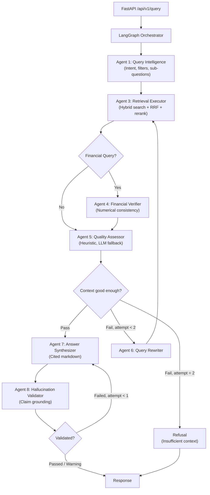

# M&A Due Diligence Intelligence Engine

[](https://www.python.org/)
[](https://qdrant.tech/)
[](https://github.com/langchain-ai/langgraph)
[]()
[](LICENSE)

A **hybrid agentic RAG engine for M&A(mergers & acquisitions) due diligence**. It ingests a multi-format data room — financial statements, merger agreements, board decks, credit agreements — and answers questions that require combining facts across several documents, with every claim traced to a source.

The design constraint that shapes everything: **in due diligence a wrong number is a hard failure, not graceful degradation.** A reviewer told "I can't find this" loses a minute. A reviewer given a confident, wrong EBITDA figure can misprice a deal. So the engine is built to refuse, and refusal is measured as carefully as accuracy.

---

## What it looks like

> **Q: What is the Section 280G excise tax exposure and which executives trigger it?**
>
> **Total potential Section 280G excise tax exposure: $2.4 million**
> **Executives triggering excess parachute payments:** Marsh (CEO), Wu, and Chen.
>
> Marsh, Wu and Chen are expected to exceed the Section 280G safe harbour threshold, exposing the Company to a 20% excise tax and the loss of the corresponding corporate tax deduction `[employment_and_retention_agreements.txt | p.2 | Section 280G]`. The Company has **not** obtained a shareholder cleansing vote…

No single passage states all of this. The exposure figure, the affected executives and the cleansing-vote status sit in different sections, and the question has to be decomposed before any of them can be retrieved.

---

## Table of Contents
- [Architecture](#architecture)
- [Core Engineering Challenges Solved](#engineering-ma-due-diligence-challenges)
- [Key Features & Advanced RAG Strategies](#key-features--advanced-rag-strategies)
- [Sub-question decomposition](#sub-question-decomposition)
- [Technology Stack](#technology-stack)
- [Model routing & quota engineering](#model-routing--quota-engineering)
- [Results](#results)
- [Quick Start](#quick-start)
- [Engineering notes](#engineering-notes)
- [Limitations](#limitations)
- [Roadmap](#roadmap)
- [Project Structure](#project-structure)

---

## Architecture

A **LangGraph StateGraph** of 7 LLM agents plus one deterministic helper, sharing typed state and checkpointed to Postgres by `(deal_id, session_id)`. Retrieval strategy selection is deterministic rather than LLM-driven — it is a lookup, and paying a model call for it would buy latency and an extra failure mode for nothing.



| # | Agent | Role |
|---|---|---|
| 1 | **Query Intelligence** | Classifies intent, extracts metadata filters, decomposes multi-fact questions into sub-questions |
| 2 | **Retrieval Strategy** *(no LLM)* | Picks dense/sparse weights and top-k by query type — zero added latency |
| 3 | **Retrieval Executor** | Hybrid search over Qdrant, Reciprocal Rank Fusion, cross-encoder rerank |
| 4 | **Financial Verifier** | Normalises units and currency, cross-checks figures against source tables |
| 5 | **Quality Assessor** | Scores whether the retrieved context can support an answer at all |
| 6 | **Query Rewriter** | Reformulates and relaxes filters when retrieval comes back thin (max 2 loops) |
| 7 | **Answer Synthesizer** | Writes the cited answer, or declines |
| 8 | **Hallucination Validator** | Checks every claim against the retrieved text and flags unsupported ones |

---

## Engineering M&A Due Diligence Challenges

M&A due diligence involves reasoning over massive, multi-format data rooms (e.g., 1000+ page PDFs, financial spreadsheets, legal contracts), where **a wrong number is a hard failure, not graceful degradation**. The engine addresses this through the following mechanisms:

**1. Memory-Efficient PDF Streaming** — Loading 1000+ page PDFs into memory causes Out-Of-Memory (OOM) failures. The ingestion pipeline uses **PyMuPDF (fitz)** to stream layout blocks and text page-by-page. It keeps the memory footprint flat regardless of document length.

**2. Multi-Page Table Stitching** — Financial statements and cap tables routinely span page breaks. Naive chunking slices these tables mid-row, destroying structure. The **MultiPageTableStitcher** extracts tables page-by-page using `pdfplumber`, fingerprints their column structures (column counts and header similarities), and automatically stitches continuation tables across page boundaries into a single markdown table section with matching page-range metadata.

**3. Cell-Level Numeric Fidelity (4-Representation Tables)** — Financial queries require exact numbers. The engine processes tables into **4 concurrent representations** sharing a single `table_id`:
- **Narrative**: A text description of key items for semantic dense matching.
- **Row-by-Row**: Key-value pairs for precise cell lookup.
- **Metrics Summary**: Deterministic pandas-computed financial metrics (YoY growth, CAGR, margins) with explicit citation chains, preventing LLM arithmetic errors.
- **Markdown**: A clean markdown grid for answer generation.

If retrieval finds *any* of these representations, a table-id lookup automatically pulls all 4 sibling chunks from Qdrant. The synthesizer receives the exact markdown grid and verified computed metrics, preventing LLM hallucinations.

**4. Hierarchical Parent-Child Context Expansion** — Retrieving small, high-density chunks is optimal for search relevance, but lacks surrounding context. The engine retrieves 512-token semantic chunks but automatically swaps them for their larger **2048-token parent chunks** (from a dedicated parent collection) before synthesis. This provides the LLM with the full context (such as definitions or footnotes) without fragmenting the retrieval.

**5. Layout-Aware Heading Detection** — Instead of hardcoded formatting rules, headings are identified using per-page statistical font-size distribution (any text block with font size > page median * 1.2 is classified as a heading), maintaining hierarchical lineage across diverse document layouts.

---

## Key Features & Advanced RAG Strategies

- **Three-Tier Chunking** — Documents undergo structural parsing, followed by semantic chunking (sentence-boundary aware with 10% overlap) and custom tables/metrics preservation to avoid fragmentation.
- **Hybrid Dense + Sparse Search** — Merges vector search (**BAAI/bge-m3**, 1024-dim) with sparse lexical search (**FastEmbed BM25**) in a unified Qdrant database.
- **Reciprocal Rank Fusion (RRF)** — Custom rank-based fusion implementation that de-duplicates overlap and merges dense and sparse rankings, explicitly ignoring raw scores to prevent scale mismatch.
- **Cross-Encoder Reranking** — Utilizes `BAAI/bge-reranker-v2-m3` for cross-attention query-passage scoring, applying a sigmoid-activation map to normalize scores within `[0,1]`.
- **Sub-Question Decomposition** — Multi-fact questions are split into atomic sub-questions, each retrieved in its own pass and reranked against *itself*, then merged by quota so every facet reaches the context (measured below).
- **Document Versioning** — Automatically flags superseded document versions and traces information lineage.
- **PII & Risk Detection** — Flags PII at ingestion (excluded from retrieval by default) and surfaces risk signals (change-of-control, MAC clauses, litigation, etc.) on a dashboard.
- **Token-Budget Governance** — Features a Postgres-backed (`BudgetTracker`) daily quota + RPM rate limiting per model, with a graceful in-memory fallback if Postgres is unavailable to keep API consumption under tight guardrails.

---

## Sub-question decomposition

This is what makes multi-hop questions work, and it is the retrieval change with the cleanest measurement behind it.

Query expansion rephrases the same question — it cannot retrieve a fact the question never asks for. Asked for an implied EV/EBITDA multiple, the engine decomposes into transaction value, share count and EBITDA, retrieves each in **its own pass reranked against itself**, then merges round-robin so every facet is represented. A passage containing only a share price scores near zero against the parent question and high against "what is the per-share merger consideration?".

Measured on retrieval alone — no synthesis, so model choice cannot influence the result:

| | baseline | with decomposition |
|---|---|---|
| All 35 answerable questions | 63.4% | **73.8% (+10.4pp)** |
| multi-hop (n=10) | 73.8% | **94.7% (+20.8)** |
| comparative (n=5) | 38.0% | **69.0% (+31.0)** |

**7 improved, 0 regressed.** Question types that are not decomposed are untouched — the gain lands exactly where evidence is genuinely spread across documents.

---

## Technology Stack

| Component | Technology | Detail |
|---|---|---|
| **Orchestration** | LangGraph | StateGraph + PostgresSaver (falls back to in-memory checkpointing) |
| **Vector Database** | Qdrant | Hybrid (dense + sparse) search, self-hosted, with local-disk fallback |
| **LLMs (Cloud)** | Gemini (via LiteLLM) | Capability-tiered ladders + multi-key rotation (see below) |
| **LLM (Local)** | Ollama / Qwen2.5-14B | Final fallback when all cloud quota is spent |
| **Embeddings** | BAAI/bge-m3 | 1024-dimensional dense vectors + FastEmbed BM25 sparse |
| **Reranker** | BAAI/bge-reranker-v2-m3 | Cross-encoder, sigmoid-normalized |
| **API Layer** | FastAPI | Structured JSON logging, async lifespan management |
| **Frontend** | Streamlit | 8 custom dashboard components (citations, risk, version history, agent trace) |
| **Database** | PostgreSQL | Budget tracking, LangGraph checkpoints |

---

## Model routing & quota engineering

The Gemini free tier is lopsided in a way that dictates the whole design: every reasoning-grade model is capped at **20 requests/day**, while the Lite tier allows **500**.

| Model | RPM | RPD | Role |
|---|---|---|---|
| `gemini-3.7-flash` | 5 | 20 | Synthesis (newest reasoning) |
| `gemini-3.6-flash` | 5 | 20 | Synthesis |
| `gemini-3.5-flash` | 5 | 20 | Synthesis |
| `gemini-3-flash-preview` | 5 | 20 | Synthesis |
| `gemini-2.5-flash` | 5 | 20 | Synthesis — grandfathered keys only |
| `gemini-3.5-flash-lite` | 15 | **500** | Agents — volume tier |
| `gemini-3.1-flash-lite` | 15 | **500** | Agents — volume tier |
| `gemini-2.5-flash-lite` | 10 | 20 | Agents — grandfathered keys only |

A query spends ~4 agent calls and 1 synthesis call. Putting agent traffic on a reasoning model would drain it in five queries and leave nothing for synthesis — the one call whose quality reaches the user. Hence **two ladders**: the agent ladder ordered by *daily capacity* with reasoning models excluded (enforced by a test), and the synthesis ladder ordered by *capability*, spilling to Lite only once the good models are spent, and finally to local Ollama.

**Keys multiply capacity, so rotation drains one key on a model before stepping down a rung** — answer quality degrades last, not first. That required a non-blocking `try_acquire()`: the natural `acquire()` sleeps until the rate window opens, which would block on a saturated key while another sat idle.

**Failures are classified by what they actually mean**, because each implies a different repair:

| Signal | Meaning | Response |
|---|---|---|
| 429 | this key is spent on this model | rotate to another key |
| 503 / timeout | the model is unresponsive for everyone | skip the model, escalating backoff, no quota debited |
| 404 "no longer available" | this key may never use this model | retire that one slot, permanently |
| auth error | the credential is bad | retire the key across all models |

That taxonomy is not academic. `gemini-2.5-flash` answers on two of five configured keys and 404s on the rest — Google grandfathers older keys when a model closes to new sign-ups, so **availability is a property of the (key, model) pair, not of the model.** Retiring the model would have discarded real capacity; retiring the key would have discarded more.

Per key: **969 agent calls/day (~242 queries)** and **95 reasoning-grade syntheses** across five rungs. Quotas live in one table — [`src/llm/model_registry.py`](src/llm/model_registry.py) — with invariant tests, because two earlier quota bugs were arithmetic errors over constants duplicated across three files.

---

## Results

Validated against a synthetic data room of **9 documents (~66K tokens)** with a hand-built golden set of **41 questions: 35 answerable** (10 of them multi-hop) plus **6 unanswerable controls** whose answers are absent by construction. The controls are what make the answer rate falsifiable — without them, "always finds the answer" and "never refuses" produce identical numbers.

| Metric | Result |
|---|---|
| Completed without an unhandled exception | 41/41 |
| Answerable questions answered | 35/35 |
| Mean fact recall | **86.3%** |
| Answers containing every expected fact | 26/35 |
| Citation-source match | 33/35 |
| Answers flagged unsupported by the validator | 0/35 |
| Controls where the engine did **not** fabricate | 6/6 |
| Latency per query | 13–36s |

Per type: legal 100%, financial 87.9%, multi-hop 82.5%, summary 80.6%, comparative 74.0%. Full per-query output, including every answer verbatim, in [`RESULTS.md`](RESULTS.md).

**One caveat matters enough to state up front.** Recall on this set moves with *which synthesis model served the run*, and that depends on daily quota and provider health rather than on anything in this repository. Six runs of identical questions against an identical index scored 86.6%, 73.9%, 71.0%, 85.9%, 62.1% and 86.3% — the 62.1% run coincided with a Gemini incident that truncated a third of its answers. `RESULTS.md` therefore records the synthesis model mix and the upstream-failure count with every report, so no figure can be read without the conditions that produced it. Retrieval changes are measured on retrieval alone for the same reason.

The refusal path is a feature, not a fallback: on all 6 controls the engine declined to invent the missing figure — usually by answering the part it *could* support and naming the gap explicitly, which is better due-diligence behaviour than a blanket refusal.

---

## Quick Start

### 1. Prerequisites
Docker and Python 3.12+.

### 2. Setup

```bash
cp .env.example .env
# Edit .env — add GEMINI_API_KEYS (one or more, comma-separated) and the DB password

pip install -r requirements.txt

# PyTorch for your GPU. --force-reinstall --no-deps is required: a plain
# `pip install torch --index-url ...` reports "Requirement already satisfied"
# against an existing CPU build and silently leaves it in place.
pip install --force-reinstall --no-deps torch --index-url https://download.pytorch.org/whl/cu128
```

Verify the GPU is actually in use — this failure is silent and costs about 5x on every query:

```bash
python -c "import torch; print(torch.__version__, torch.cuda.is_available())"
```

`2.11.0+cu128 True` is correct. Anything ending `+cpu`, or `False`, means the embedding and reranker models are running on CPU: answers are identical, but retrieval goes from under a second to 6–18s per pass. Use `cu128`+ for RTX 50-series (Blackwell), `cu118`/`cu124` for older cards.

### 3. Run it

```bash
python run_demo.py
```

Starts Docker Desktop if needed, brings up Postgres and Qdrant, waits for each to be genuinely healthy, starts the API, ingests the sample data room if the index is empty, warms the local models, and opens the UI at `http://localhost:8501`. `--stop` shuts the containers down.

Models load during startup rather than on first use, so the first question runs at the same speed as every one after it.

<details>
<summary>Other ways to run</summary>

**Fully containerized:** `docker compose up -d` — API on `:8000`, UI on `:8501`.

**Development:** `docker compose up postgres qdrant -d`, then `python run_api.py` and `streamlit run app/streamlit_app.py`.

`run_api.py` rather than `uvicorn api.main:app`, because on Windows the latter loses durable checkpointing: uvicorn hands asyncio an explicit `ProactorEventLoop` factory, psycopg refuses to run on it, and the orchestrator silently degrades to in-memory checkpoints. Setting the event loop policy does not help — a factory overrides it. On Linux the default loop is already selector-based and either command is fine.

**Local fallback model** (optional): `ollama serve && ollama pull qwen2.5:14b`.
</details>

### 4. Tests

```bash
pytest                                      # 184 tests
python tests/run_end_to_end_validation.py   # live 41-question golden set
```

---

## Engineering notes

A few decisions driven by measurement rather than intuition. The full record — including the ones that turned out to be wrong — is in [`DECISIONS_LOG.md`](DECISIONS_LOG.md).

**Quality thresholds have to be calibrated against the distribution they gate.** The context-quality gate averaged reranker scores and required `min(top_5) >= 0.2`. But a cross-encoder is a per-pair classifier and its output is sharply bimodal — relevant chunks score 0.24–0.99 on this corpus, noise sits near 0.006. Averaging meant **retrieving more candidates made context look worse**, penalising the thing it existed to reward; two questions with genuinely good context scored 0.638 and 0.645 and were refused. Rebuilt to score the *usable* evidence, with the relevance floor derived from a labelled sweep rather than chosen by hand.

**An LLM's guess must not become a hard filter.** Agent 1 infers a `document_category`, and it was applied as a hard Qdrant condition — so a wrong guess removed the answer from the search space entirely. Relaxing it on retry helped but was not sufficient: relaxation triggers on *low* context quality, and a wrong category can produce a context that scores **well** and is merely missing one required fact. Incomplete is not the same as weak, and nothing downstream could tell them apart. The filter now comes off before the search whenever the query has been decomposed.

**A binary refusal metric measures the wrong thing.** Control questions initially scored 1/3 on "refusal precision", apparently hallucinating. Reading the answers showed the opposite — the engine had reported the data that *did* exist and named the missing figure. A refused/answered flag scores that as a failure. What matters is whether it **fabricated**; re-scored on that basis, 6/6.

**Three bugs existed only on a clean environment.** A `qdrant-client` version range that resolved six minor versions ahead of the pinned server, so every gRPC write failed while REST, health checks and search kept working — the harness ran 41 questions against an empty index and reported 0% recall. An ISO date string bound to a `DATE` column, which had never failed because the long-lived database still held that column as text. And durable checkpointing that had never worked on Windows at all. Each was total, silent, and invisible to a green test suite.

**A model can be unhealthy without being broken.** When `gemini-3.7-flash` began timing out, the timeout matched none of the failure classifiers and fell through to the generic retry path — three attempts at 120s, exhausting the client's budget before a healthy model was ever tried. Timeouts are now treated as unavailability, with an escalating per-model backoff so a persistently sick model costs one attempt rather than one per query.

**Guards can be worse than the bug they fix.** A check that rejected uncited answers — added after an unsourced answer shipped at confidence 1.00 — also rejected *correct refusals*, which have nothing to cite. Three good models declined accurately, all three were scored as failures, and the ladder burned three scarce reasoning slots to land on the weakest model. It now distinguishes an answer that declines from one that asserts.

---

## Limitations

- **The corpus is synthetic and small.** 9 documents is enough that retrieval must discriminate between them, but a real data room is orders of magnitude larger. At this size the synthesizer already finds enough context for most questions, which is why decomposition shows a clear retrieval gain and a flat end-to-end one.
- **Arithmetic across documents is model-dependent.** Retrieval reliably supplies the inputs for an implied multiple; whether the model combines them correctly varies with which rung answered. The answer reports the inputs either way.
- **Citation section headings are imprecise.** They come from the chunker, which sometimes labels a mid-sentence fragment as a heading. The viewer filters the worst of it; the real fix is upstream.
- **TPM is declared but not enforced.** RPM and RPD are.
- **Single-worker API.** The deal registry is reconstructed from Qdrant rather than persisted, so it survives restarts but loses upload timestamps.

---

## Roadmap

- [ ] Per-heading granularity in the chunker, so citations carry a real section rather than a filtered guess
- [ ] Persist the deal registry in Postgres
- [ ] Enforce TPM alongside RPM/RPD — needs per-call token accounting
- [ ] Cache embeddings for repeated query expansions
- [ ] Expand the corpus enough to stress comparative and multi-hop retrieval properly

---

## Project Structure

```
run_demo.py           One-command local launcher (Docker, API, ingest, UI)
run_api.py            API entrypoint — selector event loop for Postgres checkpointing
api/                  FastAPI routes, request/response models
app/                  Streamlit UI (8 components) + dashboard
src/
  agents/             8 LangGraph agent nodes + retrieval strategy
  data_processing/    PDF/DOCX/PPTX/Excel processors, chunkers, PII/risk detectors
  llm/                LiteLLM wrapper, budget tracker, rate limiter, prompt templates
  vector_db/          Qdrant client, hybrid search, RRF fusion, reranker
  workflow/           LangGraph state machine, orchestrator, conditional edges
  utils/              Logging, token counting, audit log, metrics
tests/                184 tests + golden Q&A set + live E2E runner
config/               Qdrant, LiteLLM, and chunking YAML configs
```

---

## License

Licensed under the [MIT License](LICENSE).

---

## Author

**Makilesh M** — [LinkedIn](https://www.linkedin.com/in/makilesh/) · [GitHub](https://github.com/makilesh) · [Portfolio](https://makilesh.github.io/)
